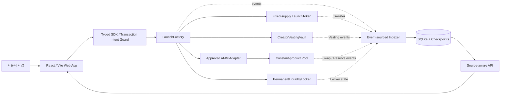

# Forge 기술 원페이지

> **아이디어를 즉시 온체인 시장으로 만드는 GIWA 런치패드**  
> 문서 기준일: 2026-07-31 · 네트워크: GIWA Sepolia (`chainId 91342`)

## 1. 제품 개요

Forge는 커뮤니티가 고정된 안전 템플릿으로 토큰을 만들고, 초기 유동성을 형성하며, 즉시 매수·매도할 수 있게 하는 한국어 우선 온체인 런치 마켓입니다.

기존 런치패드가 가격과 거래량을 중심으로 보여주는 것과 달리 Forge는 사용자가 거래 전에 다음 항목을 각각의 검증 가능한 사실로 확인하도록 설계했습니다.

- 창작자 배정 물량과 베스팅 조건
- LP 원금의 보관 위치와 출금 가능 여부
- 추가 민팅·정지·블랙리스트·거래세·프록시 권한 여부
- 홀더 집중도와 특수 주소 제외 기준
- 컨트랙트 소스 검증 상태
- 인덱서 데이터 출처와 최신성

Forge는 하나의 임의적인 “안전 점수”를 제시하지 않습니다. 확인된 사실, 아직 수집 중인 사실, 지원되지 않는 보장을 구분해 사용자가 직접 판단할 수 있도록 합니다.

## 2. 시스템 아키텍처

### 구성 요소

| 계층 | 구현 | 역할 |
| --- | --- | --- |
| Web | React, Vite, EIP-6963/injected wallet | 모바일 우선 UI, 체인 전환, 거래 의도 확인, 영수증 상태 표시 |
| SDK | TypeScript, viem | ABI·견적·승인·런치·매매 트랜잭션 생성과 런타임 검증 |
| Contracts | Solidity, Foundry | 토큰 생성, 베스팅, 풀 생성, 유동성 공급, LP 보관 |
| Indexer | Node.js, SQLite | 이벤트 수집, 재시작 복구, 리오그 롤백, 홀더·거래·위험 사실 계산 |
| Chain config | Fail-closed configuration | Anvil `31337` 또는 GIWA Sepolia `91342`만 허용하고 불완전한 배포값 차단 |

## 3. 스마트컨트랙트 설계

### `LaunchFactory`

하나의 트랜잭션 안에서 입력 검증, 토큰·베스팅 금고·풀·LP 락커 생성, 초기 유동성 공급, 표준화된 런치 이벤트 발행을 원자적으로 수행합니다. 중간 단계가 실패하면 전체 런치가 되돌려집니다.

### `LaunchToken`

- 고정 공급량: 1,000,000,000 토큰
- 배포 후 추가 민팅 없음
- 소유자, 업그레이드 프록시, 일시정지, 블랙리스트 없음
- 매수세·매도세·전송세 없음

### `CreatorVestingVault`

- 창작자 배정 비율 최대 10%
- 24시간 클리프
- 이후 30일 선형 베스팅
- 창작자·토큰·배정량·일정은 생성 후 변경 불가

### `PermanentLiquidityLocker`

생성된 LP 전량을 보관하며 원금 인출 함수나 비상 출금 경로를 제공하지 않습니다.

### `ProtocolConfig`

운영자가 변경할 수 있는 범위를 향후 런치 생성 수수료, 수수료 수령 주소, AMM 어댑터 허용 목록으로 제한합니다. 이미 생성된 토큰·금고·락커의 동작은 변경할 수 없습니다.

### AMM 경계

GIWA Sepolia에서는 Forge 자체 정률곱 AMM 어댑터를 **명시적 테스트 전용 모드**로 사용합니다. 해당 어댑터는 온체인에서 `isTestOnly() == true`를 유지하며, 외부 GIWA DEX 주소를 추측하거나 임의로 삽입하지 않습니다. 이 경로는 테스트넷 검증용이며 메인넷 준비 또는 독립 감사를 의미하지 않습니다.

## 4. 거래 및 지갑 보안 경계

- 브라우저에 개인키·시드문구 입력 기능이 없습니다.
- 모든 제품 트랜잭션은 사용자의 지갑에서 직접 서명됩니다.
- 체인·계정·대상 컨트랙트·함수·금액을 포함한 트랜잭션 의도를 서명 직전에 재확인합니다.
- 매도 승인은 무제한 승인이 아니라 필요한 수량만 정확히 승인합니다.
- 트랜잭션 영수증과 인덱서 결과를 대조해 화면 상태를 확정합니다.
- 지원되지 않는 체인, 불완전한 배포 주소, 모순된 AMM 모드는 실행 전에 실패하도록 설계했습니다.

## 5. 데이터 무결성

Forge 인덱서는 이벤트 소싱 방식으로 동작합니다.

- 로그 고유키: `chainId / blockNumber / blockHash / transactionHash / logIndex`
- 한 블록의 파생 상태와 체크포인트를 하나의 SQLite 트랜잭션으로 커밋
- 재시작 시 마지막 체크포인트부터 복구
- 블록 해시 불일치 시 포크 지점부터 롤백 후 재생
- RPC 장애 시 값을 0으로 덮어쓰지 않고 마지막 정상 스냅샷과 stale/error 상태 제공
- 잔액과 공급량은 JavaScript `Number`가 아닌 BigInt-safe 문자열로 처리
- 풀·락커·베스팅·제로·소각 주소를 일반 홀더와 분리한 뒤 집중도 계산
- 데이터마다 출처와 최신성 상태를 함께 노출

## 6. GIWA Sepolia 온체인 검증

Forge 프로토콜은 GIWA Sepolia에 배포됐으며 핵심 컨트랙트와 런치 결과 컨트랙트의 소스가 공식 익스플로러에서 검증되었습니다.

| 컨트랙트 | 주소 |
| --- | --- |
| `ProtocolConfig` | [`0x30a60f2FA757Dc95b9a38738a07D5F89Fa9c39Ea`](https://sepolia-explorer.giwa.io/address/0x30a60f2FA757Dc95b9a38738a07D5F89Fa9c39Ea?tab=contract) |
| `LaunchFactory` | [`0x7DacAa1F7d18F4E0336B21FeA2cFB9960a3d2325`](https://sepolia-explorer.giwa.io/address/0x7DacAa1F7d18F4E0336B21FeA2cFB9960a3d2325?tab=contract) |
| Test-only AMM Adapter | [`0xF27a0684a9E65709F6eD2E842d25a1F0eF734F37`](https://sepolia-explorer.giwa.io/address/0xF27a0684a9E65709F6eD2E842d25a1F0eF734F37?tab=contract) |

동일 배포에서 `launch → buy → exact-amount approve → sell` 전 과정을 실행했고 모든 영수증의 `status`가 성공으로 확인됐습니다. 생성된 `LaunchToken`, 풀, `PermanentLiquidityLocker`, `CreatorVestingVault`도 소스 검증을 완료했습니다.

체인 상태를 다시 읽어 다음 속성을 확인했습니다.

- `LaunchFactory`가 런치 토큰 잔액을 보유하지 않음
- 매도 후 어댑터 allowance가 `0`으로 정리됨
- LP 전량이 락커에 있으며 원금 출금 함수가 없음
- 토큰에 `owner`, `mint`, `pause`, `blacklist` 관리 표면이 없음
- 창작자 물량은 24시간 클리프 전 `claimable() == 0`

재현 가능한 주소·트랜잭션 해시·`cast` 명령은 [GIWA Sepolia 배포 증거 문서](./giwa-sepolia-deployment.md)에 기록했습니다.

## 7. 검증 현황

제출 후보 기준 자동화 검증 결과:

- Vitest: **151/151 통과**
- Foundry: **69/69 통과**
- GIWA public-RPC read-only fork 흐름: **7/7 통과**
- Playwright 전체 E2E: **3/3 통과**
- strict TypeScript, ESLint, formatting, ABI 생성, manifest 검증, production/public-demo build 통과
- secret scan 및 high-level dependency audit 통과

상세 실행 결과는 [검증 보고서](./verification-report.md)에서 확인할 수 있습니다.

## 8. 현재 한계와 다음 단계

현재 Forge는 **GIWA Sepolia 테스트넷 프로토타입**입니다.

- 자체 AMM 어댑터는 테스트 전용이며 독립 감사를 받지 않았습니다.
- 공개 데모는 로컬 Anvil 실행 기록을 재생하는 읽기 전용 빌드입니다.
- GIWA Wallet용 단일 컬럼 레이아웃은 구현했지만 공식 SDK·계정 세션 연동과 입점 승인은 완료되지 않았습니다.
- 외부 사용자의 리텐션, TVL, 거래량, 지불 의사는 아직 검증되지 않았습니다.

GASOK 기간에는 다음을 우선 수행합니다.

1. 스마트컨트랙트 및 유동성 경로 독립 보안 감사
2. 공식 또는 충분히 검토된 GIWA 유동성 인프라 연동
3. GIWA Wallet 호스트·세션 통합과 보안 검토
4. 독립 테스트 지갑 기반 사용자 파일럿
5. 테스트넷 관측 결과를 반영한 메인넷 설계 및 운영 통제 수립

## 9. 관련 링크

- [공개 읽기 전용 데모](https://forge-giwa-launch-eomyunsig.eomyunsig.chatgpt.site/)
- [공개 소스 저장소](https://github.com/eomyunsig-debug/forge-giwa-launch-mvp)
- [GIWA Sepolia 배포 증거](./giwa-sepolia-deployment.md)
- [위협 모델](./threat-model.md)
- [전체 검증 보고서](./verification-report.md)

---

Forge는 GIWA, 두나무 또는 업비트의 공식 서비스가 아니며, 안전·상장·가격 상승·수익을 보장하지 않습니다.
